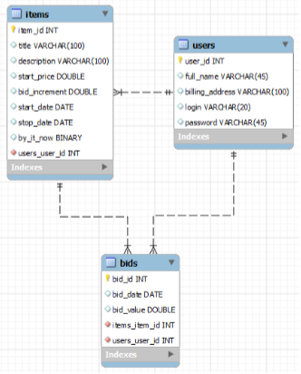



Основы баз данных и SQL
====================
//добавить задание из sql-ex.ru по SELECT и DML

Материалы для самоподготовки
---------------------
### Основные материалы - Java Strings and RegExp
1. [Презентация Реляционные базы данных](presentations/РБД%20и%20SQL_2018.pptx)
1. [Презентация Проектирование БД](presentations/ПроектированиеБД.pptx)
1. [Презентация Проектирования РБД](presentations/ОИТ%20=%20Лекция%2007a%20=%20Проектирование%20РБД.pdf)
1. [Презентация Язык SQL](presentations/ОИТ%20=%20Лекция%2007б%20=%20Язык%20SQL.pdf)
1. [Курс на w3schools](https://www.w3schools.com/sql/default.asp){:target="_blank"}
1. [ПО для выполнения задания (MySQL)](https://dev.mysql.com/downloads/installer/){:target="_blank"}
### Дополнительные материалы - Java Strings and RegExp

Практическая работа
---------------------
### Первое задание
Вам необходимо выполнить задания на сайте [sql-ex.ru](sql-ex.ru){:target="_blank"} из следующих разделов:
+ [Задания по SQL](http://sql-ex.ru/learn_exercises.php){:target="_blank"} - необходимо выполнить **13 первых заданий**
+ [Задания по DML](http://sql-ex.ru/dmlexercises.php){:target="_blank"} - необходимо выполнить **8 первых заданий**

### Второе задание
1. Вам необходимо создать схему БД «Интернет-аукцион» в соответствии со следующей EER-диаграммой:

1. Загрузить схему на сервер MySQL
1. Заполнить таблицы произвольными данными
1. Написать запросы в соответствии:
  + Список ставок данного пользователя
  + Список лотов данного пользователя
  + Поиск лотов по подстроке в названии
  + Поиск лотов по подстроке в описании
  + Средняя цена лотов каждого пользователя
  + Максимальный размер имеющихся ставок на каждый лот
  + Список действующих лотов данного пользователя
  + Добавить нового пользователя
  + Добавить новый лот
  + Удалить ставки данного пользователя
  + Удалить лоты данного пользователя
  + Увеличить стартовые цены товаров данного пользователя вдвое
1. Создать дамп базы данных

Вопросы для самоконтроля
---------------------
1. Что такое «база данных»?
1. Что такое «система управления базами данных»?
1. Что такое «реляционная база данных»?
Дайте определение терминам «простой», «составной» (composite), «потенциальный» (candidate) и «альтернативный» (alternate) ключ.
Что такое «первичный ключ» (primary key)? Каковы критерии его выбора?
Что такое «внешний ключ» (foreign key)?
Что такое «нормализация»?
Какие существуют нормальные формы?
Что такое «денормализация»? Для чего она применяется?
Какие существуют типы связей в базе данных? Приведите примеры.
Что такое «индексы»? Для чего их используют? В чём заключаются их преимущества и недостатки?
Какие типы индексов существуют?
В чем отличие между кластерными и некластерными индексами?
Имеет ли смысл индексировать данные, имеющие небольшое количество возможных значений?
Когда полное сканирование набора данных выгоднее доступа по индексу?
Что такое «транзакция»?
Назовите основные свойства транзакции.
Какие существуют уровни изолированности транзакций?
Какие проблемы могут возникать при параллельном доступе с использованием транзакций?
к оглавлению

SQL
Что такое «SQL»?
Какие существуют операторы SQL?
Что означает NULL в SQL?
Что такое «временная таблица»? Для чего она используется?
Что такое «представление» (view) и для чего оно применяется?
Каков общий синтаксис оператора SELECT?
Что такое JOIN?
Какие существуют типы JOIN?
Что лучше использовать JOIN или подзапросы?
Для чего используется оператор HAVING?
В чем различие между операторами HAVING и WHERE?
Для чего используется оператор ORDER BY?
Для чего используется оператор GROUP BY?
Как GROUP BY обрабатывает значение NULL?
В чем разница между операторами GROUP BY и DISTINCT?
Перечислите основные агрегатные функции.
В чем разница между COUNT(*) и COUNT({column})?
Что делает оператор EXISTS?
Для чего используются операторы IN, BETWEEN, LIKE?
Для чего применяется ключевое слово UNION?
Какие ограничения на целостность данных существуют в SQL?
Какие отличия между ограничениями PRIMARY и UNIQUE?
Может ли значение в столбце, на который наложено ограничение FOREIGN KEY, равняться NULL?
Как создать индекс?
Что делает оператор MERGE?
В чем отличие между операторами DELETE и TRUNCATE?
Что такое «хранимая процедура»?
Что такое «триггер»?
Что такое «курсор»?
Опишите разницу типов данных DATETIME и TIMESTAMP.
Для каких числовых типов недопустимо использовать операции сложения/вычитания?
Какое назначение у операторов PIVOT и UNPIVOT в Transact-SQL?
Расскажите об основных функциях ранжирования в Transact-SQL.
Для чего используются операторы INTERSECT, EXCEPT в Transact-SQL?
